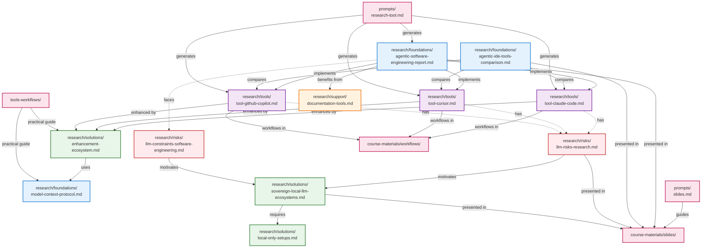

> [!IMPORTANT]
> These materials have been almost entirely generated by AI to support learning how to use AI for software engineering tasks. They are primarily intended to showcase how AI-based tools can assist not only with coding, but also with software documentation. While we have run several fact-checking passes on the generated reports and documents, some hallucinations may still remain. Please be advised.

# AI Coding Tools Course

This repository contains documentation and references—primarily AI-generated using the Deep Research feature of Perplexity or Gemini—to support the knowledge base for a 2-hour course focused on AI coding tools and agentic IDEs such as Claude Code, Codex CLI and GitHub Copilot.

## Repository Structure

```
ai-coding-tools-course/
├── course-materials/       # Teaching and learning resources
│   ├── slides/            # PDF presentations
│   └── workflows/         # Practical workflow examples
├── research/              # Deep research reports (categorized)
│   ├── foundations/       # Core concepts and architectures
│   ├── tools/             # Tool-specific analyses
│   ├── risks/             # Security and limitations
│   ├── solutions/         # Alternative approaches
│   └── support/           # Supporting tools
├── prompts/               # Templates used to generate content
├── tools-workflows/       # Practical ecosystem guide
└── example-api/           # Code examples
```

## Content Overview

### Course Materials
- **[Slides](./course-materials/slides/)** - PDF presentations covering all major topics
- **[Workflows](./course-materials/workflows/)** - Practical workflow examples (e.g., CRUD operations with Copilot)

### Research Reports

#### Foundations
Core concepts, architectures, and comparative analyses that form the theoretical foundation:
- [Agentic Software Engineering](./research/foundations/agentic-software-engineering-report.md) - Technical foundations & enterprise governance frameworks
- [Agentic IDE Tools Comparison](./research/foundations/agentic-ide-tools-comparison.md) - Comparative analysis (2021-2026)
- [Model Context Protocol](./research/foundations/model-context-protocol.md) - MCP architecture and ecosystem

#### Tools
Detailed analyses of specific AI coding assistants:
- [Claude Code](./research/tools/tool-claude-code.md) - Terminal-native agentic coding tool
- [Cursor IDE](./research/tools/tool-cursor.md) - AI-first code editor
- [GitHub Copilot](./research/tools/tool-github-copilot.md) - AI-assisted pair programmer

#### Risks
Security vulnerabilities, limitations, and constraints:
- [LLM Risks Research](./research/risks/llm-risks-research.md) - Security vulnerabilities & reproducibility threats
- [LLM Constraints](./research/risks/llm-constraints-software-engineering.md) - Technical & economic limitations

#### Solutions
Alternative approaches and privacy-focused options:
- [Sovereign Local LLM Ecosystems](./research/solutions/sovereign-local-llm-ecosystems.md) - Privacy-first systems
- [Local-Only Setups](./research/solutions/local-only-setups.md) - Hardware configurations
- [Enhancement Ecosystem](./research/solutions/enhancement-ecosystem.md) - Tools that extend AI coding assistants

#### Support
Supporting tools and platforms:
- [Documentation Tools](./research/support/documentation-tools.md) - AI-powered documentation platforms

### Prompts
Templates used to generate the research content:
- [Research Tool Prompt](./prompts/research-tool.md) - Template for deep research using AI
- [Slides Prompt](./prompts/slides.md) - Guidelines for presentation generation

### Tools & Workflows Guide
- **[tools-workflows/](./tools-workflows/)** - Comprehensive guide to AI coding tool ecosystems (Agent Skills, CodeRabbit, Ollama, Claude Code extensions, DeepWiki, MCP)

## Document Relationships

The following diagram illustrates how the different documents relate conceptually:



**Legend:**
- **Blue (Foundation)**: Core concepts and architectures
- **Purple (Tools)**: Specific tool implementations
- **Red (Risks)**: Security and constraints
- **Green (Solutions)**: Alternative approaches and enhancements
- **Orange (Support)**: Documentation tools
- **Pink (Course)**: Teaching materials and guides

Solid arrows show direct relationships; dashed arrows show concerns/motivations.

## Getting Started

For newcomers to the repository:

1. **Start with course materials** - Review [slides](./course-materials/slides/) for high-level overviews
2. **Explore research foundations** - Understand [core concepts](./research/foundations/)
3. **Learn specific tools** - Deep dive into [tool-specific analyses](./research/tools/)
4. **Check practical guides** - Review [tools-workflows](./tools-workflows/) for ecosystem recommendations
5. **Understand tradeoffs** - Read about [risks](./research/risks/) and [solutions](./research/solutions/)