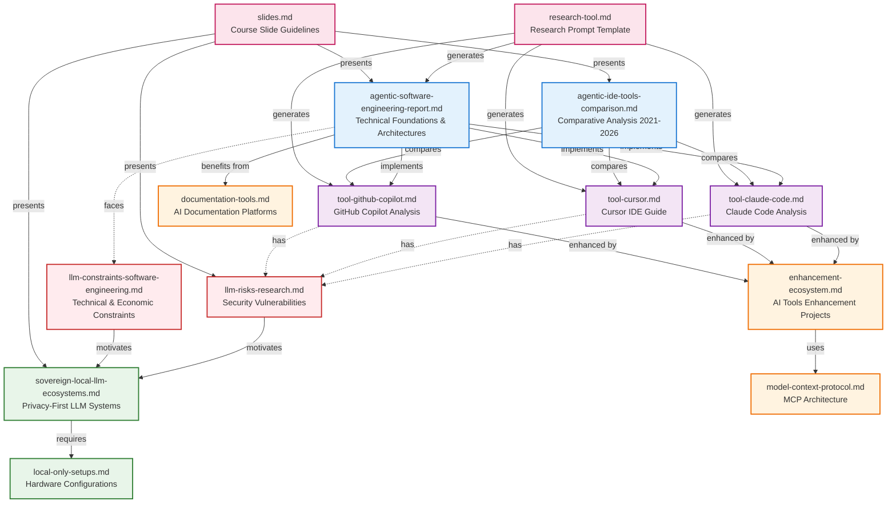

# AI Coding Tools Course

This repository contains documentation and references—primarily AI-generated using the Deep Research feature of Perplexity or Gemini—to support the knowledge base for a 2-hour course focused on AI coding tools and agentic IDEs such as Claude Code, Codex CLI and GitHub Copilot.

## Document Relationships

The following diagram illustrates how the different documents in this repository relate to each other in terms of concepts and contents:

**Legend:**
- **Blue (Foundation)**: Core concepts and comparative analyses
- **Purple (Tools)**: Specific tool implementations
- **Red (Risks)**: Security and constraint analyses
- **Green (Local)**: Privacy-focused alternatives
- **Orange (Support)**: Enhancement and documentation tools
- **Pink (Course)**: Course materials and templates

The diagram shows solid arrows for direct implementation/comparison relationships and dashed arrows for concerns/motivations.

## Markdown Files

- [agentic-ide-tools-comparison.md](./deep-research-reports/agentic-ide-tools-comparison.md) - Comparative analysis of agentic software engineering environments and IDEs (2021-2026)
- [agentic-software-engineering-report.md](./deep-research-reports/agentic-software-engineering-report.md) - Technical foundations, architectures, and enterprise governance frameworks for agentic software engineering
- [documentation-tools.md](./deep-research-reports/documentation-tools.md) - Market landscape report on AI-powered software documentation tools covering repository-level generators, API documentation platforms, and embedded code documentation systems
- [enhancement-ecosystem.md](./deep-research-reports/enhancement-ecosystem.md) - Research on GitHub repositories (200+ stars) that enhance AI coding tools through pre-packaged skills, configuration management, format conversion, and context optimization frameworks
- [llm-constraints-software-engineering.md](./deep-research-reports/llm-constraints-software-engineering.md) - Analysis of technical, economic, and structural constraints of LLMs in software engineering
- [llm-risks-research.md](./deep-research-reports/llm-risks-research.md) - Comprehensive analysis of five high-impact research papers on security vulnerabilities, reproducibility threats, and hidden costs of using LLMs in software engineering
- [research-tool.md](./prompts/research-tool.md) - Prompt template for conducting in-depth research on AI tools using official documentation
- [sovereign-local-llm-ecosystems.md](./deep-research-reports/sovereign-local-llm-ecosystems.md) - Guide to engineering local, privacy-first large language model ecosystems
- [tool-claude-code.md](./deep-research-reports/tool-claude-code.md) - Technical analysis and practical developer guide for Claude Code terminal-native agentic coding tool
- [tool-cursor.md](./deep-research-reports/tool-cursor.md) - Technical reference guide for Cursor AI-first code editor
- [tool-github-copilot.md](./deep-research-reports/tool-github-copilot.md) - Comprehensive technical analysis of GitHub Copilot AI-assisted pair programmer