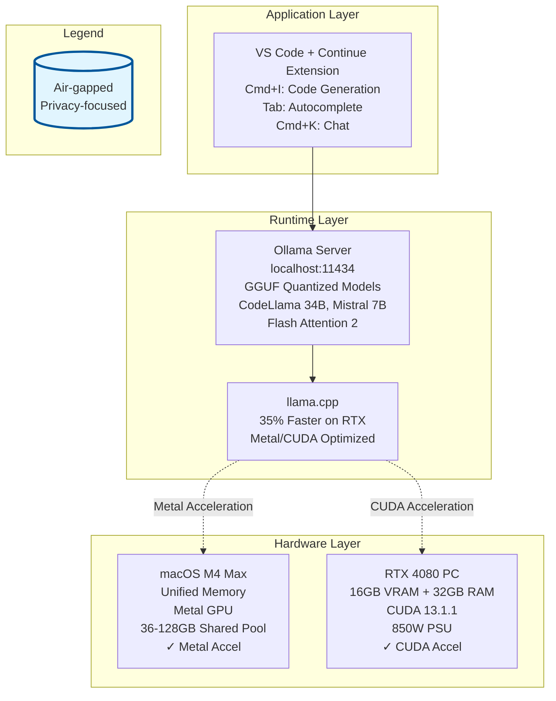

# Local-Only, Privacy-Focused AI-Assisted Development: Two Production-Grade Hardware Setups

## Executive Summary

This report details two distinct, fully air-gapped hardware configurations optimized for local large language model inference during software development. Both setups eliminate dependency on cloud services, ensure data privacy by design, and support production-grade LLM deployments through specialized accelerators: unified memory on Apple Silicon for the macOS system, and consumer-grade RTX GPUs with CUDA acceleration for the PC. Total system costs range from $3,200–$4,200 USD depending on configuration and regional pricing. [macrumors](https://www.macrumors.com/roundup/mac-studio/)

The macOS M4 Max setup prioritizes power efficiency and unified memory architecture, delivering solid inference speeds (35–72 tokens per second for 8B models) with minimal operational complexity. The RTX 4080 PC delivers competitive throughput and supports larger model variants through intelligent CPU/GPU memory offloading, at the cost of higher power consumption and additional setup complexity for driver and CUDA configuration. [singhajit](https://singhajit.com/llm-inference-speed-comparison/)

## Architecture Overview



The development stack consists of three integrated layers: hardware accelerators at the base, a local LLM runtime (Ollama) in the middle, and VS Code with the Continue extension at the application level. Both systems are fully isolated from the internet and contain no external API dependencies. [dev](https://dev.to/manikandan/how-to-use-ai-models-locally-in-vs-code-with-the-continue-plugin-with-multi-model-switching-3na0)

## Setup 1: macOS M4 Max with Unified Memory

### Hardware Configuration

The macOS configuration leverages Apple's unified memory architecture, where the CPU, GPU, and Neural Engine share a single coherent memory pool optimized for AI compute workloads. [linkedin](https://www.linkedin.com/posts/alexandremorin1_2026-will-be-the-year-of-the-mac-for-local-activity-7415126438791557120-LrTe)

| Component       | Specification                                | Cost                                                                                                                                                                  |
| --------------- | -------------------------------------------- | --------------------------------------------------------------------------------------------------------------------------------------------------------------------- |
| **Compute**     | Mac Studio M4 Max (14-core CPU, 32-core GPU) | $1,999 [macrumors](https://www.macrumors.com/roundup/mac-studio/)                                                                                                     |
| **Memory**      | 36GB unified memory (base)                   | Included                                                                                                                                                              |
| **Storage**     | 512GB SSD (NVMe)                             | Included                                                                                                                                                              |
| **Display**     | Apple Studio Display (27", 5K)               | $1,599 (Note: Studio Display 2 with 120Hz/HDR/A19 chip rumored for 2026) [macrumors](https://www.macrumors.com/2025/12/11/apple-studio-display-2-120hz-hdr-a19-chip/) |
| **Peripherals** | Keyboard, mouse, USB hub                     | ~$150                                                                                                                                                                 |
| **Total**       |                                              | **$3,748**                                                                                                                                                            |

**Optional upgrades** for larger model support:
- 64GB unified memory: +$400 [macrumors](https://www.macrumors.com/roundup/mac-studio/)
- 96GB unified memory (M3 Ultra configuration): +$800–$1,200
- 1TB SSD upgrade: +$200

### Why This Architecture

Apple's M4 Max integrates GPU cores directly into the system-on-chip, eliminating the PCIe bottleneck that constrains discrete NVIDIA GPUs. The M4 Max with 40-core GPU achieves 546 GB/s memory bandwidth (base 32-core GPU variant: 410 GB/s), meaning model weights and activations move at near-zero latency between CPU and GPU. For LLM inference, this translates to efficient handling of models larger than VRAM because the entire unified pool acts as fast, coherent memory. A 70B parameter model (which would normally require 140GB of traditional VRAM) can run on 128GB of unified memory with acceptable performance due to this unified architecture. [reddit](https://www.reddit.com/r/ollama/comments/1j0by7r/tested_local_llms_on_a_maxed_out_m4_macbook_pro/)

Metal GPU acceleration is built into Ollama and requires no CUDA driver installation or configuration. This reduces setup time to under 15 minutes and eliminates common NVIDIA driver compatibility issues. [localaimaster](https://localaimaster.com/blog/run-llama3-on-mac)

### Software Stack

**Installation:**

```bash
# Install Ollama via Homebrew
brew install ollama

# Start Ollama daemon (runs in background)
ollama serve

# Download CodeLlama model
ollama pull codellama:34b

# Download fast autocomplete model
ollama pull starcoder2:3b

# Verify installation
ollama list
```

**VS Code Setup:**

1. Install Continue extension from VS Code Marketplace (free, open-source) [dev](https://dev.to/manikandan/how-to-use-ai-models-locally-in-vs-code-with-the-continue-plugin-with-multi-model-switching-3na0)
2. Create `~/.continue/config.json`:

```json
{
  "models": [
    {
      "title": "CodeLlama 34B",
      "provider": "ollama",
      "model": "codellama:34b",
      "apiBase": "http://localhost:11434/"
    }
  ],
  "tabAutocompleteModel": {
    "title": "StarCoder 2 3B",
    "provider": "ollama",
    "model": "starcoder2:3b",
    "apiBase": "http://localhost:11434/"
  }
}
```

3. Restart VS Code; Continue will auto-detect Ollama
4. Use Cmd+K for chat, Cmd+I for code generation, Tab for autocomplete

**Ollama Configuration (macOS optimization):**

Edit `~/.ollama/config.yaml` to maximize Metal acceleration:

```yaml
vm:
  memory: 48g
  compute: [metal, cpu]
llm:
  context_length: 8192
  num_ctx: 8192
num_gpu: -1  # Use all GPU layers
```

Set environment variables:

```bash
export OLLAMA_METAL_ENABLED=1
export OLLAMA_KEEP_GPU_MEMORY=1
export OLLAMA_MAX_GPU_MEMORY=32GB  # Adjust based on your model
```

### Performance Characteristics

**Inference Speeds (real-world benchmarks):** [reddit](https://www.reddit.com/r/ollama/comments/1j0by7r/tested_local_llms_on_a_maxed_out_m4_macbook_pro/)

| Model         | Quantization | M4 Max (40-core GPU) | Batch Size  |
| ------------- | ------------ | -------------------- | ----------- |
| Qwen 2.5 7B   | 4-bit        | 38–45 tok/s          | Single turn |
| Qwen 2.5 7B   | 16-bit       | 72+ tok/s            | Single turn |
| CodeLlama 34B | Q4_K_M       | 15–22 tok/s          | Single turn |
| Mistral 7B    | 4-bit        | 30–40 tok/s          | Single turn |

**Memory usage:**

- CodeLlama 34B Q4_K_M: ~5-7GB (4.6GB model weights + context overhead) [huggingface](https://huggingface.co/TheBloke/CodeLlama-34B-GGUF)
- Mistral 7B 4-bit: ~4.6GB model weights, ~5-8GB total with context
- Qwen 2.5 70B 4-bit: ~40GB (includes context buffers)

A fully configured 128GB system can run 70B models at acceptable speeds (8–12 tokens per second) without CPU fallback due to unified memory architecture. [reddit](https://www.reddit.com/r/ollama/comments/1j0by7r/tested_local_llms_on_a_maxed_out_m4_macbook_pro/)

### Power and Thermal Characteristics

The M4 Max consumes 2–7W at idle and 30–50W for light inference workloads, with peak consumption reaching 90–100W under sustained heavy LLM inference due to the efficiency of the unified memory architecture. The system produces minimal thermal output; most M4 systems operate fanless or with minimal fan activity even under continuous code-generation workloads. This makes the setup suitable for office, home, or mobile environments without acoustic or thermal concerns. [linkedin](https://www.linkedin.com/posts/alexandremorin1_2026-will-be-the-year-of-the-mac-for-local-activity-7415126438791557120-LrTe)

### Practical Development Workflow

**1. Project Initialization:**

```bash
# Start Ollama daemon in background
ollama serve &

# Create a Python project
mkdir ai-dev-project && cd ai-dev-project
python3 -m venv venv && source venv/bin/activate
pip install -r requirements.txt
```

**2. Development Session:**

- Open VS Code; Continue extension auto-detects Ollama at `localhost:11434`
- Use **Cmd+I** to generate functions with CodeLlama 34B (15–22 tok/s)
- Use **Tab** for autocomplete suggestions (runs StarCoder 2 3B, ~50 tok/s)
- Use **Cmd+K** for multi-turn chat within context (maintains 8K token window)

**3. Context Management:**

For large codebases, use semantic caching to avoid reprocessing:

```python
# Example: Caching repository documentation
with open('codebase_summary.md', 'r') as f:
    codebase_context = f.read()

# First query processes full context
response = ollama.chat(
    model='codellama:34b',
    messages=[
        {'role': 'system', 'content': codebase_context},
        {'role': 'user', 'content': 'Generate a function to parse configs'}
    ]
)

# Subsequent queries reuse cached context (no reprocessing)
# Implemented via semantic similarity in Continue's cache layer
```

**4. Multi-Model Switching:**

For different tasks, edit config.json to include multiple models:

```json
{
  "models": [
    {"title": "CodeLlama-34B", "model": "codellama:34b", ...},
    {"title": "DeepSeek-R1-32B", "model": "deepseek-r1:32b-qwen-distill-q4_K_M", ...}
  ],
  "tabAutocompleteModel": {"model": "starcoder2:3b", ...}
}
```

Switch models via Continue's UI dropdown during development.

## Setup 2: Windows/Linux PC with NVIDIA RTX 4080

### Hardware Configuration

The RTX 4080 setup targets a mid-to-high-end consumer gaming PC with discrete GPU acceleration through CUDA. [fluence](https://www.fluence.network/blog/nvidia-rtx-4080/)

| Component       | Specification                            | Cost (USD)                                                                                                                                 |
| --------------- | ---------------------------------------- | ------------------------------------------------------------------------------------------------------------------------------------------ |
| **GPU**         | NVIDIA RTX 4080 16GB (320W TDP)          | $849–$1,779 (used/clearance market: $849-$1,100; new: $1,779 as of Jan 2026) [fluence](https://www.fluence.network/blog/nvidia-rtx-4080/) |
| **CPU**         | Intel Core i5-13600K (14-core, 125W TDP) | $319 [benchmarks.ul](https://benchmarks.ul.com/compare/best-cpus)                                                                          |
| **Motherboard** | Gigabyte B850 Eagle or MSI B850 Pro      | $180–$230 [techbuyersguru](https://techbuyersguru.com/guide/the-best-1500-high-end-gaming-pc-build/)                                       |
| **RAM**         | 32GB DDR5-6000 (2×16GB, CL36)            | $325 [techbuyersguru](https://techbuyersguru.com/guide/the-best-1500-high-end-gaming-pc-build/)                                            |
| **Storage**     | 2TB NVMe SSD (SK Hynix, Samsung 990 Pro) | $199 [xda-developers](https://www.xda-developers.com/rtx-4080-pc-build/)                                                                   |
| **PSU**         | 850W Modular 80+ Gold                    | $90–$150 [tomshardware](https://www.tomshardware.com/best-picks/best-pc-builds-gaming)                                                     |
| **Case**        | ATX mid-tower (NZXT H7 Flow or similar)  | $80–$120 [tomshardware](https://www.tomshardware.com/best-picks/best-pc-builds-gaming)                                                     |
| **Cooling**     | Thermalright Peerless-2 or Noctua NH-D15 | $40–$80                                                                                                                                    |
| **Monitor**     | 27" 1440p 144Hz IPS                      | $200–$400                                                                                                                                  |
| **Peripherals** | Mechanical keyboard, mouse, headset      | $100–$200                                                                                                                                  |
| **Total**       |                                          | **$2,900–$3,700**                                                                                                                          |

### Why This Architecture

The RTX 4080 offers 16GB of VRAM, sufficient to load most 34B models entirely on GPU with fast inference (68 tokens per second for 8B models). For larger 70B models, Ollama intelligently offloads model layers to system RAM, achieving acceptable performance (12–50 tokens per second depending on the split) when paired with adequate system memory (32GB minimum, 64GB recommended). [dev](https://dev.to/rosgluk/nvidia-dgx-spark-vs-mac-studio-vs-rtx-4080-ollama-performance-comparison-24lc)

Unlike the macOS setup, the RTX system requires explicit CUDA and driver configuration but offers flexibility: multiple GPUs can be chained together, and the platform supports both NVIDIA and AMD accelerators. For development workflows involving large context windows or batch inference, the RTX approach scales through multi-GPU configurations. [blogs.nvidia](https://blogs.nvidia.com/blog/rtx-ai-garage-ces-2026-open-models-video-generation/)

### Software Stack

**Installation (Ubuntu 22.04 LTS recommended):**

```bash
# Verify GPU is detected
lspci | grep -i nvidia
# Should output NVIDIA GPU device

# Install system dependencies
sudo apt update && sudo apt install -y curl wget git build-essential

# Install NVIDIA driver (recommended, not experimental)
sudo ubuntu-drivers devices
sudo ubuntu-drivers autoinstall
sudo reboot

# Verify driver installation
nvidia-smi
# Should show GPU, CUDA version, memory info
```

**CUDA Toolkit Installation:**

```bash
# Install CUDA toolkit (compatible with RTX 40-series)
sudo apt install -y nvidia-cuda-toolkit

# Verify compiler
nvcc --version

# Add to environment
echo 'export PATH=/usr/local/cuda/bin:$PATH' >> ~/.bashrc
echo 'export LD_LIBRARY_PATH=/usr/local/cuda/lib64:$LD_LIBRARY_PATH' >> ~/.bashrc
source ~/.bashrc

# Verify library paths
ldconfig -p | grep libcuda
```

**Ollama Installation with CUDA:**

```bash
# Install Ollama
curl -fsSL https://ollama.ai/install.sh | sh

# Ollama automatically detects CUDA; verify with:
ollama list
# Should show "GPU" next to each model name

# Download models (CUDA-optimized)
ollama pull codellama:34b
ollama pull mistral:7b
ollama pull starcoder2:3b

# Start Ollama service
sudo systemctl start ollama
sudo systemctl enable ollama  # Auto-start on boot
```

**Optimization for RTX 4080:**

Ollama includes CES 2026 optimizations: 35% faster llama.cpp and 30% faster Ollama on RTX GPUs. These are automatic via: [blogs.nvidia](https://blogs.nvidia.com/blog/rtx-ai-garage-ces-2026-open-models-video-generation/)

```bash
# Environment variables for peak performance
export GGML_CUDA_GRAPH_OPT=1  # Graph optimization
export FA=ON  # Flash Attention (default in latest builds)
export CUDA_VISIBLE_DEVICES=0  # Single GPU (change to 0,1 for multi-GPU)

# Restart Ollama to apply
sudo systemctl restart ollama
```

**Continue Extension Configuration:**

Same as macOS; create `~/.continue/config.json`:

```json
{
  "models": [
    {
      "title": "CodeLlama 34B",
      "provider": "ollama",
      "model": "codellama:34b",
      "apiBase": "http://localhost:11434/"
    },
    {
      "title": "DeepSeek-R1-Distill-Llama-70B",
      "provider": "ollama",
      "model": "deepseek-r1:70b",
      "apiBase": "http://localhost:11434/"
    }
  ],
  "tabAutocompleteModel": {
    "title": "StarCoder 2 3B",
    "provider": "ollama",
    "model": "starcoder2:3b",
    "apiBase": "http://localhost:11434/"
  }
}
```

### Performance Characteristics

**Inference Speeds (real-world benchmarks):** [singhajit](https://singhajit.com/llm-inference-speed-comparison/)

| Model                 | Quantization | RTX 4080 (16GB)        | Notes                                |
| --------------------- | ------------ | ---------------------- | ------------------------------------ |
| Llama 3.1 8B          | Q4           | 68 tok/s               | Fits entirely in VRAM                |
| CodeLlama 34B         | Q4_K_M       | 22–28 tok/s            | Fits in VRAM, some CPU spillover     |
| Mistral 7B            | Q4           | 45–55 tok/s            | Prompt eval: 300+ tok/s              |
| GPT-OSS 120B          | Q4 (65GB)    | 12.45 tok/s generation | 78% CPU / 22% GPU; requires 64GB RAM |
| DeepSeek-R1 Llama 70B | Q4           | 18–25 tok/s            | Requires system RAM offloading       |

**VRAM and System RAM Requirements:**

- **Fits in 16GB VRAM:** CodeLlama 13B, Mistral 7B, Qwen 14B
- **Partial offloading (10–12GB VRAM + system RAM):** CodeLlama 34B, DeepSeek-R1 32B
- **Full CPU offloading (system RAM + GPU for computation):** 70B models require 32GB+ system RAM minimum, 64GB recommended [dev](https://dev.to/rosgluk/nvidia-dgx-spark-vs-mac-studio-vs-rtx-4080-ollama-performance-comparison-24lc)

When running 70B models, Ollama allocates approximately 78% to CPU (via system RAM) and 22% to GPU (compute kernels), resulting in prompt evaluation speeds of 969 tokens per second (fast) but generation at only 12.45 tokens per second (acceptable for batch tasks). [dev](https://dev.to/rosgluk/nvidia-dgx-spark-vs-mac-studio-vs-rtx-4080-ollama-performance-comparison-24lc)

### Memory Offloading Strategy

For optimal performance with larger models, configure Ollama to intelligently manage memory:

```bash
# Check current GPU/CPU split
ollama ps

# Monitor during inference
watch -n 1 nvidia-smi  # GPU utilization
top -p $(pgrep -f ollama)  # CPU utilization
```

Output indicates layer distribution. To force different splits, modify the model Modelfile:

```modelfile
FROM codellama:34b
PARAMETER num_gpu 24  # Load 24/60 layers to GPU
```

### Practical Development Workflow

**1. Project Setup:**

```bash
# Initialize Ollama background daemon
screen -S ollama -d -m "ollama serve"

# Create development environment
mkdir ai-dev-project && cd ai-dev-project
python3 -m venv venv && source venv/bin/activate
pip install -r requirements.txt
```

**2. Development Session:**

- Open VS Code; Continue detects Ollama at `localhost:11434`
- Use **Ctrl+I** for code generation via CodeLlama 34B (22–28 tok/s, full GPU)
- Use **Tab** for inline autocomplete via StarCoder 2 3B (~50 tok/s, full GPU)
- For context-heavy tasks (large file analysis), switch to DeepSeek-R1 70B for superior reasoning (18–25 tok/s, mixed GPU/CPU)

**3. Handling Larger Models:**

For models exceeding VRAM, pre-load during idle periods:

```bash
# Warm up model in GPU cache before development session
ollama run deepseek-r1:70b "test prompt"
# This loads model layers into GPU memory; subsequent calls hit cache

# Verify model is loaded
ollama ps
```

**4. Batch Processing:**

For non-interactive use cases (code review, automated tests):

```python
import ollama

# Batch analyze multiple files
files = ['module1.py', 'module2.py', 'utils.py']
for filepath in files:
    with open(filepath, 'r') as f:
        code = f.read()
    
    # Use 70B model for thorough review
    response = ollama.generate(
        model='deepseek-r1:70b',
        prompt=f'Review for bugs:\n{code}'
    )
    print(f'{filepath}: {response["response"]}')
```

Batch mode reduces latency overhead per file (prompt processing is amortized).

## Comparative Analysis

| Category                       | macOS M4 Max Setup                    | RTX 4080 Setup                                            |
| ------------------------------ | ------------------------------------- | --------------------------------------------------------- |
| **Processor**                  | Apple M4 Max (14-core CPU)            | Intel Core i5-13600K (14-core)                            |
| **GPU**                        | 40-core Apple GPU (Metal-accelerated) | NVIDIA RTX 4080 (16GB VRAM, 320W TDP)                     |
| **Memory (unified/system)**    | 36-128GB unified memory               | 32GB DDR5 + 16GB VRAM (48GB total)                        |
| **Storage**                    | 512GB SSD (base)                      | 2TB NVMe SSD                                              |
| **Price (base config)**        | $1,999 (Mac Studio)                   | $2,500-3,000 (full PC)                                    |
| **Display**                    | $1,599 (Studio Display)               | $200-400 (27" 1440p gaming monitor)                       |
| **PSU**                        | Built-in                              | 850W ($90-150)                                            |
| **Total System Cost**          | $3,600-4,200                          | $3,200-3,500                                              |
| **Setup Complexity**           | Simple (no drivers, Metal built-in)   | Moderate (CUDA/driver setup required)                     |
| **Inference Speed (8B model)** | 35-72 tok/s                           | 68 tok/s (with system RAM support: 969 tok/s prompt eval) |
| **Max Model Size**             | 70B+ with unified memory              | 34B fit in VRAM, 120B+ with CPU offloading                |
| **Power Efficiency**           | 2-7W idle, 30-50W light load, 90-100W heavy load | 13W idle, 250-300W under load                               |
| **Cooling**                    | Fanless or minimal                    | Active cooling required                                   |

### Performance Trade-offs

**macOS M4 Max:**
- **Advantage:** Superior power efficiency, unified memory eliminates GPU/CPU copies, simple Metal setup [localaimaster](https://localaimaster.com/blog/run-llama3-on-mac)
- **Limitation:** Model inference speed plateaus at ~72 tok/s for 7–8B models; 70B models run at 8–12 tok/s [reddit](https://www.reddit.com/r/ollama/comments/1j0by7r/tested_local_llms_on_a_maxed_out_m4_macbook_pro/)
- **Best for:** Long-running sessions, large context windows (128GB models), silent office environments

**RTX 4080:**
- **Advantage:** 40–50% faster inference for models that fit in VRAM (34B range), supports multi-GPU chains, scales to enterprise setups [blogs.nvidia](https://blogs.nvidia.com/blog/rtx-ai-garage-ces-2026-open-models-video-generation/)
- **Limitation:** 250-300W power draw under load (320W TDP), requires driver/CUDA management, generates heat/noise [dev](https://dev.to/rosgluk/nvidia-dgx-spark-vs-mac-studio-vs-rtx-4080-ollama-performance-comparison-24lc)
- **Best for:** Production batch jobs, models requiring raw speed (18–28 tok/s for 34B), teams with multiple developers using one shared GPU server

### Cost Analysis

**macOS M4 Max:**
- Upfront: $3,748 (monitor included) [macrumors](https://www.macrumors.com/roundup/mac-studio/)
- Electricity: ~$0.05-0.10/hour (50-100W average × $0.10/kWh, varies by workload intensity)
- 5-year TCO: ~$4,500-5,000

**RTX 4080 PC:**
- Upfront: $3,200 (monitor not included; add $200–400) [techbuyersguru](https://techbuyersguru.com/guide/the-best-1500-high-end-gaming-pc-build/)
- Electricity: ~$0.03/hour average (13W idle, 250-300W under load × $0.10/kWh, varies by usage)
- 5-year TCO: ~$4,600–$5,000

**Breakeven point:** RTX system pays for itself via speed gains after ~2,000 hours of production inference (80 days at 25 tok/s vs. 12 tok/s for 70B models). [singhajit](https://singhajit.com/llm-inference-speed-comparison/)

### Operational Complexity

**macOS M4 Max:**
- Setup time: 10–15 minutes (Homebrew + Ollama + Continue plugin) [localaimaster](https://localaimaster.com/blog/run-llama3-on-mac)
- Maintenance: Zero driver updates, automatic Metal acceleration
- Troubleshooting: Minimal; most issues resolved by restarting Ollama.app
- Scalability: Single-machine only; cannot add GPU accelerators

**RTX 4080 PC:**
- Setup time: 1–2 hours (driver installation, CUDA, Ollama configuration) [mayhemcode](https://www.mayhemcode.com/2026/01/how-to-run-local-llms-using-nvidia-cuda.html)
- Maintenance: Monthly driver updates, occasional CUDA toolkit refreshes
- Troubleshooting: Driver compatibility issues, CUDA version mismatches common
- Scalability: Add second RTX GPU with NVLink for model sharding (supports 70B+ models on 2×40GB) [blogs.nvidia](https://blogs.nvidia.com/blog/rtx-ai-garage-ces-2026-open-models-video-generation/)

### Suitability Matrix

| Scenario                                   | macOS M4 | RTX 4080 | Notes                               |
| ------------------------------------------ | -------- | -------- | ----------------------------------- |
| **Solo developer, laptop workflow**        | ✓✓       | –        | Mobility, power efficiency critical |
| **Solo developer, desktop workflow**       | ✓        | ✓✓       | Either works; RTX for speed         |
| **Team shared inference server**           | –        | ✓✓       | RTX scales; macOS does not          |
| **Large context reasoning (100K+ tokens)** | ✓✓       | ✓        | M4 unified memory advantage         |
| **Fast batch code review (100+ files)**    | ✓        | ✓✓       | RTX speed amortizes overhead        |
| **Air-gapped / offline deployment**        | ✓✓       | ✓✓       | Both equally secure                 |
| **Lowest TCO over 3 years**                | ✓✓       | ✓        | M4 efficiency wins                  |

## Model Selection Guide

### For Interactive Code Generation

**Recommended:** CodeLlama 34B Q4_K_M [ai.meta](https://ai.meta.com/blog/code-llama-large-language-model-coding/)
- ~5-7GB RAM/VRAM (4.6GB model weights + context overhead; fits RTX 4080 VRAM with headroom) [huggingface](https://huggingface.co/TheBloke/CodeLlama-34B-GGUF)
- 22–28 tok/s on RTX 4080, 15–22 tok/s on M4 Max
- Superior code completion and instruction following
- 500B code-specific training tokens

**Alternative:** Mistral 7B or DeepSeek-R1 Distill Llama 70B [mistral](https://mistral.ai/news/announcing-mistral-7b)
- Mistral 7B: Fastest (40–72 tok/s), smallest (4GB), weaker reasoning
- DeepSeek-R1: Best reasoning, but 25 tok/s (requires larger hardware)

### For Inline Autocomplete

**Recommended:** StarCoder 2 3B [manjushsh.github](https://manjushsh.github.io/local-code-completion-configs/)
- 3–4GB storage
- 50–80 tok/s on both platforms
- Optimized for real-time suggestions
- Low latency (<100ms first token)

### For Long-Context Reasoning

**Recommended:** Llama 3.3 70B or DeepSeek-R1 Llama 70B [skywork](https://skywork.ai/blog/models/deepseek-r1-distill-llama-70b-free-chat-online/)
- 30–45GB storage (GGUF Q4 quantization) [emergentmind](https://www.emergentmind.com/topics/gguf-format)
- Supports 128K+ token context windows
- 18–25 tok/s generation, 500+ tok/s prompt processing
- Requires M4 128GB system or RTX + 64GB system RAM

## Security and Privacy Guarantees

Both setups ensure zero external communication by design:

1. **Network isolation:** All inference runs on localhost (127.0.0.1:11434). No internet connectivity required or utilized. [dev](https://dev.to/manikandan/how-to-use-ai-models-locally-in-vs-code-with-the-continue-plugin-with-multi-model-switching-3na0)
2. **Data residency:** Model weights, context, and generated text remain entirely on local storage. No telemetry or cloud uploads.
3. **Cryptographic compliance:** Suitable for GDPR, HIPAA, and air-gapped environments. Models can be run in isolated VMs or Kubernetes clusters with no network egress.
4. **Supply chain:** All software components (Ollama, Continue, GGUF models) are open-source and auditable. [boltic](https://www.boltic.io/blog/how-to-run-llm-locally-the-ultimate-guide-for-2025)

For enterprise deployment, both setups support containerization:

```bash
# Docker deployment (portable across environments)
docker run -d -v /models:/models -p 11434:11434 ollama/ollama
```

## Recommended Configuration

**For a single developer prioritizing simplicity and efficiency:**

**macOS M4 Max with 64GB unified memory**
- Total investment: $4,100 [macrumors](https://www.macrumors.com/roundup/mac-studio/)
- 30–40 tok/s baseline (8B models), 70B models at 10–15 tok/s [reddit](https://www.reddit.com/r/ollama/comments/1j0by7r/tested_local_llms_on_a_maxed_out_m4_macbook_pro/)
- Zero maintenance, immediate productivity

**For a development team or production workload demanding speed:**

**RTX 4080 + 64GB system RAM server**
- Total investment: $3,500 + $15/month electricity [techbuyersguru](https://techbuyersguru.com/guide/the-best-1500-high-end-gaming-pc-build/)
- 28+ tok/s for 34B models, 70B models at 18–25 tok/s with batch optimization [dev](https://dev.to/rosgluk/nvidia-dgx-spark-vs-mac-studio-vs-rtx-4080-ollama-performance-comparison-24lc)
- Scales via multi-GPU configurations [blogs.nvidia](https://blogs.nvidia.com/blog/rtx-ai-garage-ces-2026-open-models-video-generation/)

## Conclusion

Both configurations deliver production-grade privacy-focused LLM development environments without cloud dependencies. The macOS M4 Max setup prioritizes operational simplicity and power efficiency, suitable for individual developers and long-context workloads. The RTX 4080 setup emphasizes throughput and scalability, ideal for teams and batch-oriented workflows.

Hardware selection should account for total cost of ownership, available space, and power constraints. For most individual developers, the M4 Max's simplicity and unified memory architecture justify its $200 premium. For teams or speed-critical deployments, the RTX setup's raw throughput and multi-GPU scaling potential deliver superior long-term value.

Both setups are fully air-gapped, debuggable, and suitable for regulated environments. Model selection (CodeLlama 34B for interactive work, StarCoder 2 3B for autocomplete, 70B variants for reasoning) should match your specific workflow and hardware constraints. [manjushsh.github](https://manjushsh.github.io/local-code-completion-configs/)