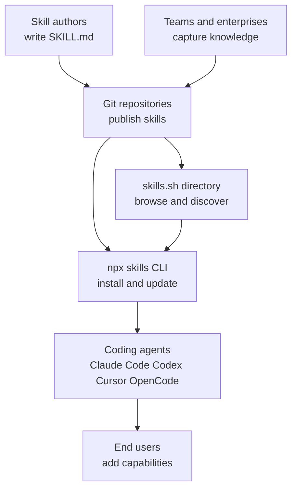
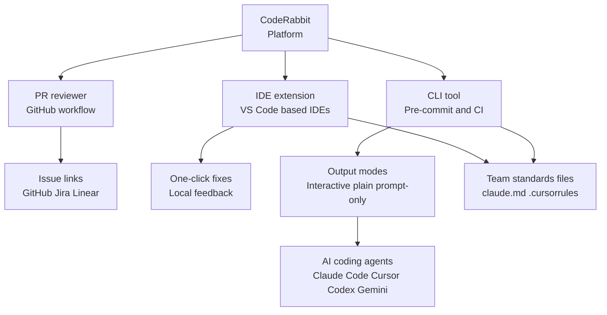
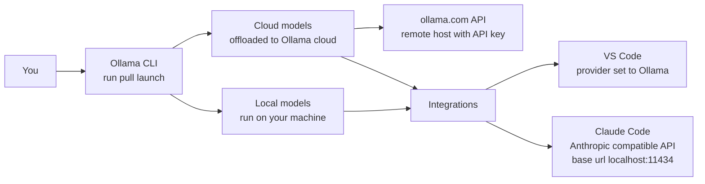
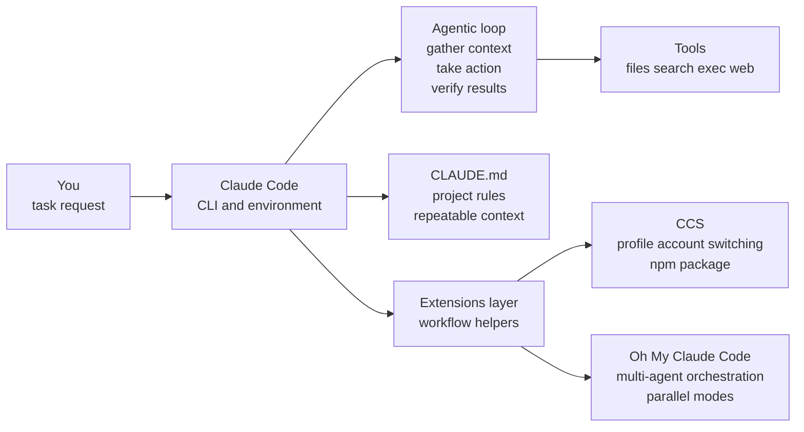
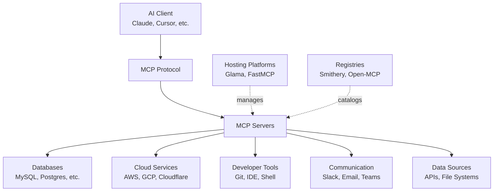

# AI Coding Tools & Workflows: Recommended Ecosystem

## Overview

This guide introduces essential tools and ecosystems that enhance AI-assisted software development. Whether you're new to AI coding assistants or looking to optimize your workflow, you'll find practical resources and clear starting points here.

**What you'll learn:**
- How to extend AI agents with reusable skills
- Tools for automated code review and quality checks
- Options for running language models locally
- Ways to enhance your Claude Code workflow
- How to connect AI assistants to external resources

---

## Agent Skills Ecosystem

**What it is:** A framework for creating portable, version-controlled packages of procedural knowledge that AI agents can load on-demand.

**Why it matters:** Skills let you package instructions and context once, then reuse them across projects and different AI coding agents—eliminating the need to repeatedly explain the same patterns.

### Key Resources

- **Concept overview:** https://agentskills.io/home
- **Main repository:** https://github.com/agentskills/agentskills
- **CLI tool (Vercel):** https://github.com/vercel-labs/skills
- **Skill directory:** https://skills.sh/

### How It Works

Skills are defined in `SKILL.md` files with YAML frontmatter. Using the `npx skills` CLI, you can:

- Install skills from GitHub, GitLab, git URLs, or local paths
- Manage skills across different coding agents (Claude Code, Codex, Cursor, OpenCode)
- Update, list, find, and remove skills as needed
- Discover popular skills through the browsable directory at skills.sh

### Core Concepts

| Concept               | Description                                            |
| --------------------- | ------------------------------------------------------ |
| **Portability**       | Same skill works across multiple agent products        |
| **Discoverability**   | Browse popular skills via leaderboard-style directory  |
| **Team knowledge**    | Capture organizational conventions in reusable formats |
| **On-demand loading** | Agents fetch skills only when needed                   |

### Architecture Overview

---

## CodeRabbit

**What it is:** A comprehensive code review system that provides feedback throughout the development lifecycle—from uncommitted changes in your editor to final PR reviews.

**Why it matters:** Shifts code review left (earlier in development) while catching bugs and maintainability issues before they reach production. Offers one-click fixes and learns from your team's feedback patterns.

### Key Resources

- **Main docs:** https://docs.coderabbit.ai/
- **PR review overview:** https://docs.coderabbit.ai/overview/pull-request-review
- **IDE/CLI review:** https://docs.coderabbit.ai/overview/ide-cli-review
- **CLI docs:** https://docs.coderabbit.ai/cli

### How It Works

CodeRabbit operates across three environments:

1. **Pull Request Reviews:** Incremental feedback as new commits arrive
2. **IDE Integration:** Real-time review of uncommitted changes in VS Code, Cursor, and Windsurf
3. **CLI Tool:** Pre-commit checks and CI/CD pipeline integration

### Key Features

| Feature               | Description                                                           |
| --------------------- | --------------------------------------------------------------------- |
| **One-click fixes**   | Available in PRs and IDE; CLI supports quick fixes + AI agent handoff |
| **Context-aware**     | Reviews beyond just changed lines; reads team standards files         |
| **Team standards**    | Auto-applies rules from `claude.md` and `.cursorrules`                |
| **Work item linking** | Connects to GitHub, Jira, or Linear issues                            |
| **Output modes**      | Interactive, plain text, or "prompt-only" mode for AI agents          |

### Architecture Overview

---

## Ollama

**What it is:** A tool for running large language models locally on your machine through a simple CLI workflow.

**Why it matters:** Gives you full control over model execution—run models locally when possible, or offload to Ollama's cloud service for larger models—all through the same interface.

### Key Resources

- **Main docs:** https://docs.ollama.com/
- **Quickstart:** https://docs.ollama.com/quickstart
- **Cloud models:** https://docs.ollama.com/cloud
- **VS Code integration:** https://docs.ollama.com/integrations/vscode
- **Claude Code integration:** https://docs.ollama.com/integrations/claude-code

### How It Works

1. **Install** Ollama on your machine
2. **Pull or run** a model from the terminal (e.g., `ollama run llama2`)
3. **Integrate** with your editor or coding agent

### Execution Modes

| Mode             | When to Use                                                                     |
| ---------------- | ------------------------------------------------------------------------------- |
| **Local models** | Your machine has sufficient resources (CPU/GPU)                                 |
| **Cloud models** | Need larger models without powerful local hardware; requires ollama.com account |
| **Remote API**   | Call cloud models directly using API key via `https://ollama.com/api/tags`      |

### Integration Examples

**VS Code:**
- Select Ollama as the provider in model manager
- Choose models directly from the interface

**Claude Code:**
- Connect via Anthropic-compatible API
- Set base URL to local Ollama endpoint (e.g., `http://localhost:11434`)
- Use `ollama launch` for quick setup

### Architecture Overview

---

## Claude Code Ecosystem

**What it is:** A coding agent that operates in your terminal, iteratively gathering context, taking action, and verifying results to complete tasks.

**Why it matters:** Goes beyond answering questions—directly edits files, runs commands, and integrates into your development workflow. Uses project-local `CLAUDE.md` for persistent instructions across sessions.

### Key Resources

- **Overview:** https://code.claude.com/docs/en/overview
- **How it works:** https://code.claude.com/docs/en/how-claude-code-works

### The Agentic Loop

Claude Code operates through three continuous steps:

1. **Gather context** - Understand the task and current state
2. **Take action** - Use tools (file ops, search, shell, web)
3. **Verify results** - Confirm changes meet requirements

### Workflow Extensions

Two notable GitHub projects extend Claude Code's capabilities:

#### CCS (Claude Code Switcher)

- **Repository:** https://github.com/kaitranntt/ccs
- **Purpose:** Simplifies account/profile switching
- **Installation:** `npm install -g @kaitranntt/ccs`
- **Example usage:** `ccs auth create primary`, `ccs auth create secondary`

#### Oh My Claude Code

- **Repository:** https://github.com/Yeachan-Heo/oh-my-claudecode
- **Website:** https://yeachan-heo.github.io/oh-my-claudecode-website/
- **Purpose:** Multi-agent orchestration system with ready-made modes
- **Key feature:** Parallelize work across specialized agents for faster execution

### Core Concepts

| Concept                    | Description                                                                         |
| -------------------------- | ----------------------------------------------------------------------------------- |
| **Tool-backed agency**     | File operations, shell commands, search, and web access as first-class capabilities |
| **Project guidance**       | Store rules and conventions in `CLAUDE.md` for session persistence                  |
| **Workflow extensions**    | Tools like CCS handle profile switching; Oh My Claude Code handles coordination     |
| **Iterative verification** | Loop continues until task completion is verified                                    |

### Architecture Overview

---

## Model Context Protocol (MCP)

**What it is:** An open standard that allows AI models to securely connect with local and remote resources through standardized server implementations.

**Why it matters:** Provides a universal adapter for AI assistants to access databases, APIs, file systems, and cloud services consistently—like USB-C for AI integrations.

### Key Resources

- **State of MCP 2025:** https://glama.ai/blog/2025-12-07-the-state-of-mcp-in-2025
- **Awesome MCP Servers:** https://github.com/punkpeye/awesome-mcp-servers

### Ecosystem Scale (2025)

- **11,000+** MCP servers registered
- **15,000+** developers contributing on GitHub
- **80K** Reddit members
- **9.5K** Discord members
- **31M** weekly NPM downloads
- **$73M+** venture capital raised by MCP-focused companies

### Server Categories

The ecosystem spans diverse domains:

- **Aggregators** - Unified access to multiple services
- **Browser automation** - Web interaction and scraping
- **Cloud platforms** - AWS, GCP, Cloudflare integrations
- **Databases** - MySQL, Postgres, MongoDB connectors
- **Communication** - Slack, Email, Teams integration
- **Developer tools** - Git, IDE, shell access
- **Knowledge management** - Note-taking, documentation systems
- **Specialized domains** - Bioinformatics, aerospace, and more

### Technology Stack

| Language   | Usage                                   |
| ---------- | --------------------------------------- |
| Python     | Popular for data and ML integrations    |
| TypeScript | Web and Node.js ecosystems              |
| Go         | High-performance server implementations |
| Rust       | System-level integrations               |
| C# / Java  | Enterprise integrations                 |

### Key Trends

1. **Remote over local** - Remote MCP servers have become the standard due to ease of use and security
2. **MCP-first APIs** - Companies building SaaS APIs with MCP as primary distribution channel
3. **Enterprise adoption** - Growing demand for private registries with audited servers
4. **Platform evolution** - Shift from chat-based to background agents and workflows
5. **Interactive capabilities** - New proposals like MCP Apps introducing UI features

### Challenges

- **Monetization** - Unclear models for open-source server authors
- **Sustainability** - ~50% of initial wave companies have pivoted or shut down
- **Discovery** - Need for better cataloging and quality assurance

### Architecture Overview

