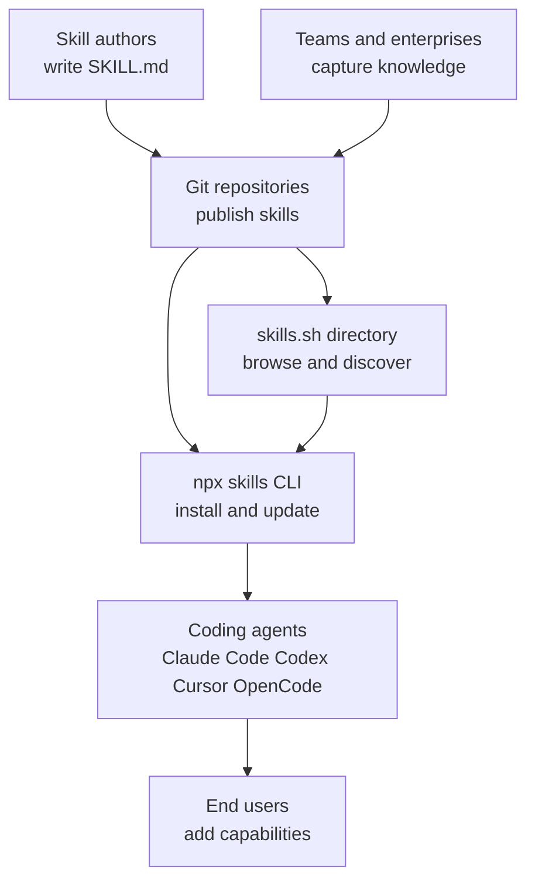
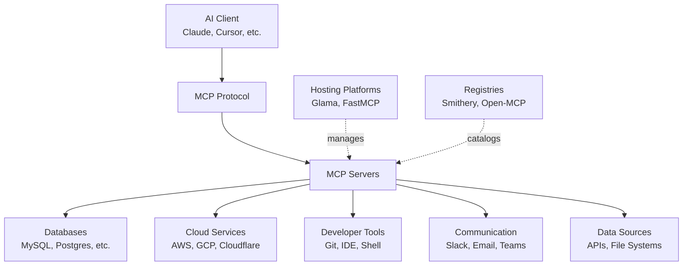

# Suggested Tools and Ecosystems

## Agent Skills ecosystem

Agent Skills frames “skills” as portable, version-controlled packages of procedural knowledge and context that AI agents can load on demand, so they can do real work more reliably instead of guessing missing details.  The core idea is that the same skill can be reused across different agent products, while also helping teams capture and share organizational know-how in a consistent way.  To explore the concept: https://agentskills.io/home and the associated repo entry point: https://github.com/agentskills/agentskills. 

On the ecosystem side, Vercel’s open-source CLI at https://github.com/vercel-labs/skills positions skills as installable “instruction sets” defined in `SKILL.md` files with simple YAML frontmatter, fetched from GitHub, GitLab, any git URL, or even local paths.  In practice, this makes skills feel a bit like “plugins for agent behavior”: you can add, list, find, remove, and update skills, and target different coding agents such as Claude Code, Codex, Cursor, OpenCode, and many more. [github](https://github.com/mermaid-js/mermaid)

Discovery happens through a directory-style site at https://skills.sh/ that surfaces a large leaderboard of skills and repositories, making it easy to see what’s popular and find starting points.  Put together with the CLI’s `find` and install flows, the story becomes cohesive: write skills once, publish them in git, discover them via a shared index, and install them into whichever agent you use. [docs.github](https://docs.github.com/en/get-started/writing-on-github/working-with-advanced-formatting/creating-diagrams)

Key concepts to keep in mind:
- Skills are reusable instructions plus context that agents can load on demand to perform specialized tasks and repeatable workflows. 
- Interoperability is a main goal: the same skill can be used across different “skills-compatible” agent products. 
- The `npx skills` CLI can install skills from many source formats and manage them over time, including updates and agent-specific installation targets. [github](https://github.com/mermaid-js/mermaid)
- The skills directory at https://skills.sh/ provides a browseable, leaderboard-like view of the ecosystem to help with discovery. [docs.github](https://docs.github.com/en/get-started/writing-on-github/working-with-advanced-formatting/creating-diagrams)

## CodeRabbit

CodeRabbit is a **code** review system that tries to cover the whole journey from “I’m still editing” to “ready to merge,” combining pull request reviews with local feedback in your editor and terminal.  Its PR reviewer focuses on catching real bugs and maintainability issues early, supports one-click fixes, and can refine its future feedback based on what your team accepts or rejects over time.  You can explore the main docs at https://docs.coderabbit.ai/ and the PR review overview at https://docs.coderabbit.ai/overview/pull-request-review. 

A key idea across the docs is shifting review left while keeping the PR as the shared collaboration point: in IDEs like VS Code, Cursor, and Windsurf you can review uncommitted changes and apply fixes immediately, while the CLI is designed for pre-commit checks and CI-friendly workflows.  The CLI supports different output modes including interactive, plain text, and a “prompt-only” mode meant to hand findings to an AI coding agent, and it can also auto-read team standards files like claude.md and .cursorrules so reviews match your conventions.  See the IDE and CLI overview at https://docs.coderabbit.ai/overview/ide-cli-review and the CLI docs at https://docs.coderabbit.ai/cli. 

- Review coverage: PR reviews update incrementally as new commits arrive, while local IDE and CLI reviews focus on uncommitted changes when context is freshest.   
- Fix workflow: “One-click fixes” exist in PRs and the IDE flow, and the CLI supports quick fixes plus handoff of harder changes to AI agents.   
- Context and standards: Reviews can be context-aware beyond changed lines, and can automatically apply your documented team rules via common agent config files.   
- Toolchain fit: PR reviews can link work items from GitHub, Jira, or Linear, and the CLI is explicitly positioned as useful in CI CD pipelines.   

## Ollama

Ollama is a way to run and work with language models through a simple local workflow: install it, pull or run a model from the terminal, and then use that same engine from tools you already use.  The docs hub at https://docs.ollama.com/ points you to the Quickstart and integrations so you can go from “first model running” to “model inside my editor” without having to learn a whole new platform. 

A helpful mental model is that Ollama gives you one consistent interface, and you choose where the model runs: **local** on your machine when it fits, or “cloud models” when you want something bigger without needing a powerful GPU.  Cloud models are designed to offload execution to Ollama’s cloud service while keeping your local tools and workflows the same, and they require signing in with an ollama.com account.  If you prefer to call cloud models directly, Ollama also describes using ollama.com as a remote host via its API with an API key (for example setting `OLLAMA_API_KEY` and listing models via `https://ollama.com/api/tags`). 

Once you’re comfortable with the basics, the same models can show up in developer tools: the Quickstart highlights `ollama launch` as a fast way to set up coding integrations (including Claude Code).  In VS Code, the integration is presented as selecting Ollama as the provider and then choosing models from the model manager.  For Claude Code, the docs describe connecting through an Anthropic-compatible API by pointing the base URL to your local Ollama server (for example `http://localhost:11434`) and then running Claude Code with an Ollama model. 

Key concepts to keep in mind
- One workflow: run models from the CLI and reuse them via integrations and APIs. 
- Two execution modes: local models on your machine, cloud models offloaded to Ollama’s cloud for larger capability. 
- Editor and agent integrations: VS Code can pick Ollama as a provider, and Claude Code can connect via an Anthropic-compatible API to a local Ollama endpoint. 
- Useful starting links: https://docs.ollama.com/ and https://docs.ollama.com/quickstart plus cloud and integrations at https://docs.ollama.com/cloud, https://docs.ollama.com/integrations/vscode, https://docs.ollama.com/integrations/claude-code. 

## Claude Code Ecosystem

Claude Code is best understood as a “coding agent in your terminal”: you describe a task, and it iterates through an agentic loop of **gather context**, take action, and verify results, using tools like file operations, search, shell execution, and web lookups as needed.  The official overview frames it as something that not only answers questions, but can directly edit files, run commands, and fit into existing developer workflows across CLI and other environments, while relying on a project-local `CLAUDE.md` to carry instructions across otherwise fresh sessions.  See https://code.claude.com/docs/en/overview and https://code.claude.com/docs/en/how-claude-code-works for the conceptual model and how the loop, tools, sessions, and context management fit together. [pressbooks.atlanticoer-relatlantique](https://pressbooks.atlanticoer-relatlantique.ca/writingforsuccess/chapter/6-1-purpose-audience-tone-and-content/)

Two significant GitHub projects sit naturally “on top” of that core loop by focusing on workflow-level ergonomics and orchestration rather than reinventing the agent itself. CCS at https://github.com/kaitranntt/ccs is positioned as a CLI that helps with account or profile switching for Claude Code, with example setup commands like `ccs auth create primary` and `ccs auth create secondary`, and it’s distributed as `@kaitranntt/ccs` on npm.  Oh My Claude Code at https://github.com/Yeachan-Heo/oh-my-claudecode (also described at https://yeachan-heo.github.io/oh-my-claudecode-website/) presents itself as an “enhancement system” that adds multi-agent orchestration and ready-made modes you can trigger with short phrases, aiming to parallelize work across specialized agents for faster execution. [linkedin](https://www.linkedin.com/pulse/i-built-something-myself-5-days-later-developers-started-tam-nhu-tran-rtbte)

Key ideas to keep in mind:

- Agentic loop: Context then action then verification, repeated until the task is done. [pressbooks.atlanticoer-relatlantique](https://pressbooks.atlanticoer-relatlantique.ca/writingforsuccess/chapter/6-1-purpose-audience-tone-and-content/)
- Tool-backed agency: Reading and editing files, running commands, searching, and web access are first-class capabilities, not add-ons. [pressbooks.atlanticoer-relatlantique](https://pressbooks.atlanticoer-relatlantique.ca/writingforsuccess/chapter/6-1-purpose-audience-tone-and-content/)
- Project guidance: Put durable rules and conventions in `CLAUDE.md` because sessions do not persist memory across runs. [pressbooks.atlanticoer-relatlantique](https://pressbooks.atlanticoer-relatlantique.ca/writingforsuccess/chapter/6-1-purpose-audience-tone-and-content/)
- Workflow extensions: Tools like https://github.com/kaitranntt/ccs target operational friction like switching profiles, while https://github.com/Yeachan-Heo/oh-my-claudecode targets coordination friction like parallel work. [github](https://github.com/Yeachan-Heo/oh-my-claudecode/blob/main/AGENTS.md)

## MCP

The Model Context Protocol (MCP) is an open standard that allows AI models like Claude to securely connect with both local and remote resources through standardized server implementations. Think of it as a universal adapter that lets AI assistants tap into databases, APIs, file systems, and cloud services in a consistent way. The ecosystem has grown dramatically, with over 11,000 MCP servers registered in 2025 and contributions from more than 15,000 developers on GitHub according to https://glama.ai/blog/2025-12-07-the-state-of-mcp-in-2025. The community has coalesced around a comprehensive collection of production-ready and experimental servers catalogued at https://github.com/punkpeye/awesome-mcp-servers, spanning everything from database connectors and browser automation to cloud platform integrations and specialized tools for fields like bioinformatics and aerospace.

The landscape has matured significantly, with clear trends emerging around consolidation and platform evolution. Remote MCP servers have decisively won over local implementations due to ease of use and security considerations, while companies are increasingly building "MCP-first" SaaS APIs as a new distribution channel. The ecosystem now includes specialized hosting platforms, observability tools, integration platforms, and enterprise-focused private registries for audited servers. However, challenges remain around monetization models for open-source server authors and the sustainability of community-maintained projects, as roughly half of the initial wave of companies have either pivoted or shut down.

Key Concepts:

- **Server Categories**: The ecosystem spans aggregators, browser automation, cloud platforms, databases, communication tools, developer tools, knowledge management, and specialized domains
- **Community Scale**: 80K Reddit members, 9.5K Discord members, 31M weekly NPM downloads, and at least $73M in venture capital raised by MCP-focused companies
- **Technology Stack**: Servers are built in multiple languages including Python, TypeScript, Go, Rust, C#, and Java, supporting both local and cloud deployments
- **Evolution**: The focus is shifting from chat-based usage to background agents and workflows, with new proposals like MCP Apps introducing interactive UI capabilities
- **Enterprise Adoption**: Growing demand for private "intranet" registries where organizations can host and monitor their own audited MCP servers

