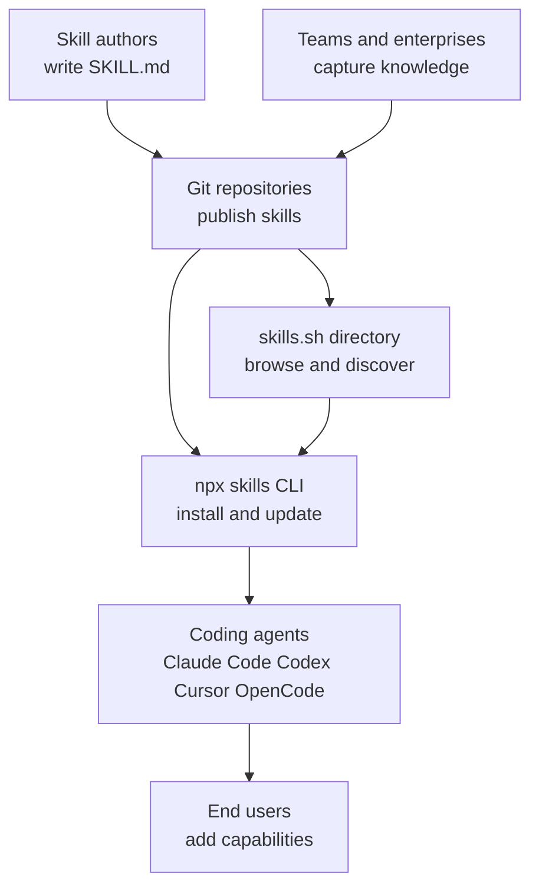

# Suggested Tools and Ecosystems

## Agent Skills ecosystem

Agent Skills frames “skills” as portable, version-controlled packages of procedural knowledge and context that AI agents can load on demand, so they can do real work more reliably instead of guessing missing details.  The core idea is that the same skill can be reused across different agent products, while also helping teams capture and share organizational know-how in a consistent way.  To explore the concept: https://agentskills.io/home and the associated repo entry point: https://github.com/agentskills/agentskills. 

On the ecosystem side, Vercel’s open-source CLI at https://github.com/vercel-labs/skills positions skills as installable “instruction sets” defined in `SKILL.md` files with simple YAML frontmatter, fetched from GitHub, GitLab, any git URL, or even local paths.  In practice, this makes skills feel a bit like “plugins for agent behavior”: you can add, list, find, remove, and update skills, and target different coding agents such as Claude Code, Codex, Cursor, OpenCode, and many more. [github](https://github.com/mermaid-js/mermaid)

Discovery happens through a directory-style site at https://skills.sh/ that surfaces a large leaderboard of skills and repositories, making it easy to see what’s popular and find starting points.  Put together with the CLI’s `find` and install flows, the story becomes cohesive: write skills once, publish them in git, discover them via a shared index, and install them into whichever agent you use. [docs.github](https://docs.github.com/en/get-started/writing-on-github/working-with-advanced-formatting/creating-diagrams)

Key concepts to keep in mind:
- Skills are reusable instructions plus context that agents can load on demand to perform specialized tasks and repeatable workflows. 
- Interoperability is a main goal: the same skill can be used across different “skills-compatible” agent products. 
- The `npx skills` CLI can install skills from many source formats and manage them over time, including updates and agent-specific installation targets. [github](https://github.com/mermaid-js/mermaid)
- The skills directory at https://skills.sh/ provides a browseable, leaderboard-like view of the ecosystem to help with discovery. [docs.github](https://docs.github.com/en/get-started/writing-on-github/working-with-advanced-formatting/creating-diagrams)

## CodeRabbit

CodeRabbit is a **code** review system that tries to cover the whole journey from “I’m still editing” to “ready to merge,” combining pull request reviews with local feedback in your editor and terminal.  Its PR reviewer focuses on catching real bugs and maintainability issues early, supports one-click fixes, and can refine its future feedback based on what your team accepts or rejects over time.  You can explore the main docs at https://docs.coderabbit.ai/ and the PR review overview at https://docs.coderabbit.ai/overview/pull-request-review. 

A key idea across the docs is shifting review left while keeping the PR as the shared collaboration point: in IDEs like VS Code, Cursor, and Windsurf you can review uncommitted changes and apply fixes immediately, while the CLI is designed for pre-commit checks and CI-friendly workflows.  The CLI supports different output modes including interactive, plain text, and a “prompt-only” mode meant to hand findings to an AI coding agent, and it can also auto-read team standards files like claude.md and .cursorrules so reviews match your conventions.  See the IDE and CLI overview at https://docs.coderabbit.ai/overview/ide-cli-review and the CLI docs at https://docs.coderabbit.ai/cli. 

- Review coverage: PR reviews update incrementally as new commits arrive, while local IDE and CLI reviews focus on uncommitted changes when context is freshest.   
- Fix workflow: “One-click fixes” exist in PRs and the IDE flow, and the CLI supports quick fixes plus handoff of harder changes to AI agents.   
- Context and standards: Reviews can be context-aware beyond changed lines, and can automatically apply your documented team rules via common agent config files.   
- Toolchain fit: PR reviews can link work items from GitHub, Jira, or Linear, and the CLI is explicitly positioned as useful in CI CD pipelines.   

