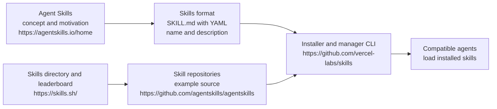

# Suggested Tools and Ecosystems

## Agent Skills ecosystem

https://agentskills.io/home frames “Agent Skills” as portable, version-controlled packages that give agents on-demand access to procedural knowledge plus company, team, and user context so they can do reliable real work.  It positions skills as reusable building blocks across products, benefiting skill authors, agent builders, and enterprises by enabling domain expertise, new capabilities, repeatable workflows, and interoperability. 

https://github.com/vercel-labs/skills provides the operational layer: a CLI that installs and manages skills across many agent environments, using `npx skills add ...` and related commands to list, find, remove, check, and update skills.  It also defines the core artifact shape as `SKILL.md` with YAML frontmatter including required `name` and `description`, with skills discoverable in common repo locations and installable from GitHub, GitLab, generic git URLs, or local paths. [github](https://github.com/mermaid-js/mermaid)

https://skills.sh/ acts as the discovery surface, presenting a directory with leaderboard and trending views that point to specific skill repositories and named skills.  Taken together, https://agentskills.io/home describes why and what skills are, https://github.com/vercel-labs/skills makes them installable and agent-compatible in practice, and https://skills.sh/ helps users find skills to install, while https://github.com/agentskills/agentskills is included as a GitHub source alongside this ecosystem. [docs.github](https://docs.github.com/en/get-started/writing-on-github/working-with-advanced-formatting/creating-diagrams)

- Skills package procedural knowledge and context into reusable units that agents can load on demand.   
- The CLI standardizes installing and managing `SKILL.md`-based skills across many agent tools. [github](https://github.com/mermaid-js/mermaid)
- The directory site indexes and ranks skills to support discovery, connecting users to repositories to install from. [docs.github](https://docs.github.com/en/get-started/writing-on-github/working-with-advanced-formatting/creating-diagrams)

