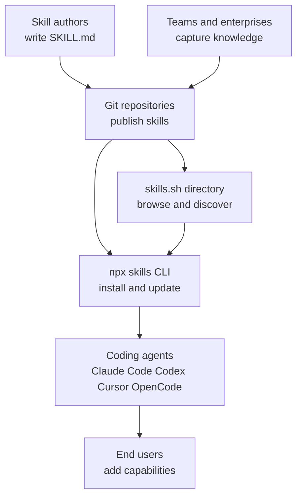
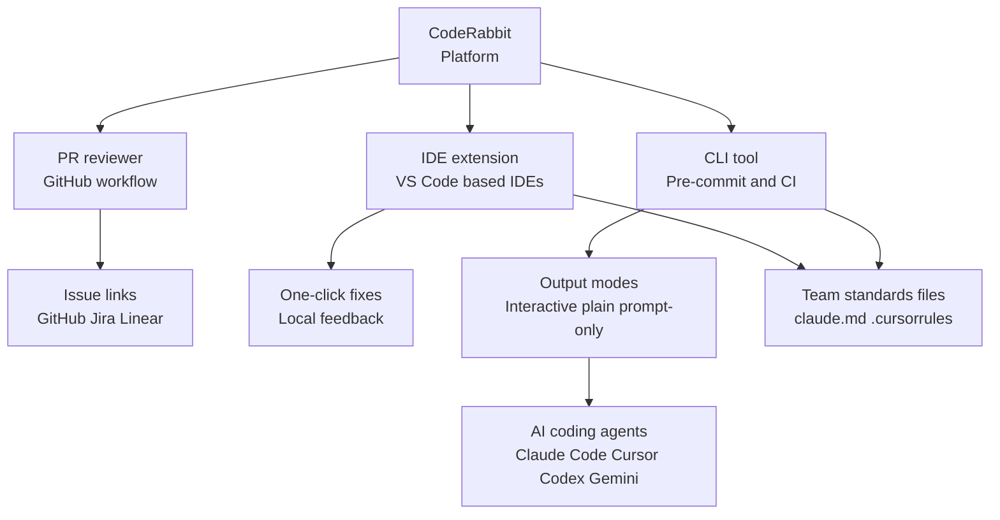
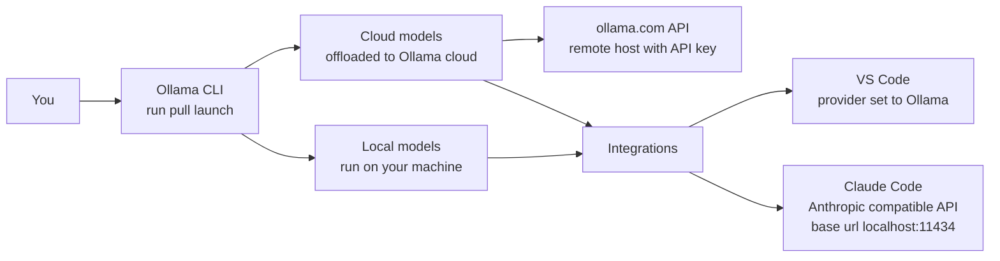
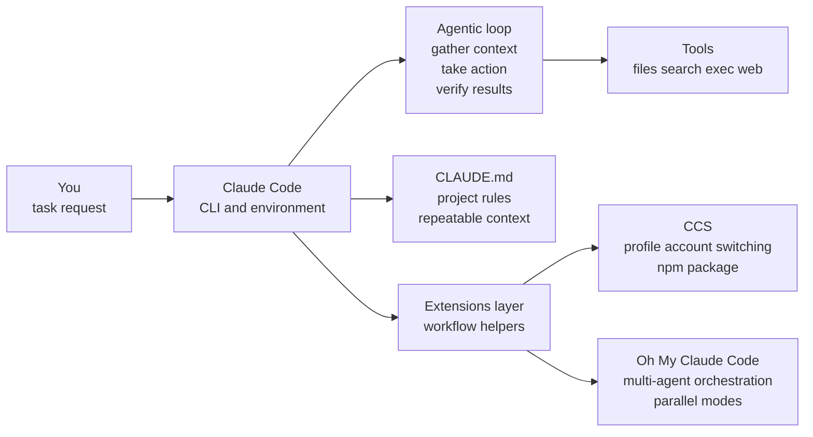
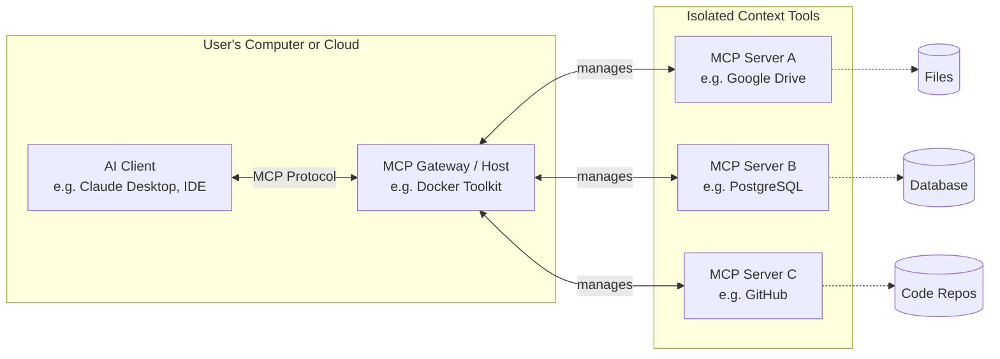

# AI Coding Tools & Workflows: Recommended Ecosystem

## Overview

This guide introduces essential tools and ecosystems that enhance AI-assisted software development. Whether you're new to AI coding assistants or looking to optimize your workflow, you'll find practical resources and clear starting points here.

**What you'll learn:**
- How to extend AI agents with reusable skills
- Tools for automated code review and quality checks
- Options for running language models locally
- Ways to enhance your Claude Code workflow
- How to connect AI assistants to external resources

---

## Agent Skills Ecosystem

**What it is:** A framework for creating portable, version-controlled packages of procedural knowledge that AI agents can load on-demand.

**Why it matters:** Skills let you package instructions and context once, then reuse them across projects and different AI coding agents—eliminating the need to repeatedly explain the same patterns.

### Key Resources

- **Concept overview:** https://agentskills.io/home
- **Main repository:** https://github.com/agentskills/agentskills
- **CLI tool (Vercel):** https://github.com/vercel-labs/skills
- **Skill directory:** https://skills.sh/

### How It Works

Skills are defined in `SKILL.md` files with YAML frontmatter. Using the `npx skills` CLI, you can:

- Install skills from GitHub, GitLab, git URLs, or local paths
- Manage skills across different coding agents (Claude Code, Codex, Cursor, OpenCode)
- Update, list, find, and remove skills as needed
- Discover popular skills through the browsable directory at skills.sh

### Core Concepts

| Concept               | Description                                            |
| --------------------- | ------------------------------------------------------ |
| **Portability**       | Same skill works across multiple agent products        |
| **Discoverability**   | Browse popular skills via leaderboard-style directory  |
| **Team knowledge**    | Capture organizational conventions in reusable formats |
| **On-demand loading** | Agents fetch skills only when needed                   |

### Architecture Overview

---

## CodeRabbit

**What it is:** A comprehensive code review system that provides feedback throughout the development lifecycle—from uncommitted changes in your editor to final PR reviews.

**Why it matters:** Shifts code review left (earlier in development) while catching bugs and maintainability issues before they reach production. Offers one-click fixes and learns from your team's feedback patterns.

### Key Resources

- **Main docs:** https://docs.coderabbit.ai/
- **PR review overview:** https://docs.coderabbit.ai/overview/pull-request-review
- **IDE/CLI review:** https://docs.coderabbit.ai/overview/ide-cli-review
- **CLI docs:** https://docs.coderabbit.ai/cli

### How It Works

CodeRabbit operates across three environments:

1. **Pull Request Reviews:** Incremental feedback as new commits arrive
2. **IDE Integration:** Real-time review of uncommitted changes in VS Code, Cursor, and Windsurf
3. **CLI Tool:** Pre-commit checks and CI/CD pipeline integration

### Key Features

| Feature               | Description                                                           |
| --------------------- | --------------------------------------------------------------------- |
| **One-click fixes**   | Available in PRs and IDE; CLI supports quick fixes + AI agent handoff |
| **Context-aware**     | Reviews beyond just changed lines; reads team standards files         |
| **Team standards**    | Auto-applies rules from `claude.md` and `.cursorrules`                |
| **Work item linking** | Connects to GitHub, Jira, or Linear issues                            |
| **Output modes**      | Interactive, plain text, or "prompt-only" mode for AI agents          |

### Architecture Overview

---

## Ollama

**What it is:** A tool for running large language models locally on your machine through a simple CLI workflow.

**Why it matters:** Gives you full control over model execution—run models locally when possible, or offload to Ollama's cloud service for larger models—all through the same interface.

### Key Resources

- **Main docs:** https://docs.ollama.com/
- **Quickstart:** https://docs.ollama.com/quickstart
- **Cloud models:** https://docs.ollama.com/cloud
- **VS Code integration:** https://docs.ollama.com/integrations/vscode
- **Claude Code integration:** https://docs.ollama.com/integrations/claude-code

### How It Works

1. **Install** Ollama on your machine
2. **Pull or run** a model from the terminal (e.g., `ollama run llama2`)
3. **Integrate** with your editor or coding agent

### Execution Modes

| Mode             | When to Use                                                                     |
| ---------------- | ------------------------------------------------------------------------------- |
| **Local models** | Your machine has sufficient resources (CPU/GPU)                                 |
| **Cloud models** | Need larger models without powerful local hardware; requires ollama.com account |
| **Remote API**   | Call cloud models directly using API key via `https://ollama.com/api/tags`      |

### Integration Examples

**VS Code:**
- Select Ollama as the provider in model manager
- Choose models directly from the interface

**Claude Code:**
- Connect via Anthropic-compatible API
- Set base URL to local Ollama endpoint (e.g., `http://localhost:11434`)
- Use `ollama launch` for quick setup

### Architecture Overview

---

## Claude Code Ecosystem

**What it is:** A coding agent that operates in your terminal, iteratively gathering context, taking action, and verifying results to complete tasks.

**Why it matters:** Goes beyond answering questions—directly edits files, runs commands, and integrates into your development workflow. Uses project-local `CLAUDE.md` for persistent instructions across sessions.

### Key Resources

- **Overview:** https://code.claude.com/docs/en/overview
- **How it works:** https://code.claude.com/docs/en/how-claude-code-works

### The Agentic Loop

Claude Code operates through three continuous steps:

1. **Gather context** - Understand the task and current state
2. **Take action** - Use tools (file ops, search, shell, web)
3. **Verify results** - Confirm changes meet requirements

### Workflow Extensions

Two notable GitHub projects extend Claude Code's capabilities:

#### CCS (Claude Code Switcher)

- **Repository:** https://github.com/kaitranntt/ccs
- **Purpose:** Simplifies account/profile switching
- **Installation:** `npm install -g @kaitranntt/ccs`
- **Example usage:** `ccs auth create primary`, `ccs auth create secondary`

#### Oh My Claude Code

- **Repository:** https://github.com/Yeachan-Heo/oh-my-claudecode
- **Website:** https://yeachan-heo.github.io/oh-my-claudecode-website/
- **Purpose:** Multi-agent orchestration system with ready-made modes
- **Key feature:** Parallelize work across specialized agents for faster execution

### Core Concepts

| Concept                    | Description                                                                         |
| -------------------------- | ----------------------------------------------------------------------------------- |
| **Tool-backed agency**     | File operations, shell commands, search, and web access as first-class capabilities |
| **Project guidance**       | Store rules and conventions in `CLAUDE.md` for session persistence                  |
| **Workflow extensions**    | Tools like CCS handle profile switching; Oh My Claude Code handles coordination     |
| **Iterative verification** | Loop continues until task completion is verified                                    |

### Architecture Overview

---

## DeepWiki (Devin)

**What it is:** Devin's auto-generated wiki for codebases that indexes repositories and produces architecture diagrams, source links, and summaries to help you quickly understand unfamiliar code.

**Why it matters:** It gives teams an always-available, context-grounded knowledge base and makes it easier to ask precise questions about a codebase via "Ask Devin."

### Key Resources

- **DeepWiki product overview:** https://docs.devin.ai/work-with-devin/deepwiki
- **Public DeepWiki site:** https://deepwiki.com/
- **DeepWiki MCP Server:** https://docs.devin.ai/work-with-devin/deepwiki-mcp

### How It Works

1. **Auto-indexing:** DeepWiki is generated during repo connection/onboarding.
2. **Wiki + diagrams:** It builds documentation with architecture diagrams and links to source.
3. **Ask Devin:** Devin can answer questions using the wiki context.

### Steering the Output

You can control wiki generation with a `.devin/wiki.json` file (repo notes + specific pages) to ensure critical areas are documented.

### Programmatic Access (MCP)

The DeepWiki MCP server exposes tools to read wiki structure, read wiki contents, and ask questions about public repos.

---

## Model Context Protocol (MCP)

**What it is:** A universal protocol for connecting AI assistants to external data sources and tools—effectively functioning as "USB-C for AI applications."

**Why it matters:** Solves the challenge of keeping AI context-aware by providing a standard way to interface with local files, databases, and APIs. Build a connection once and use it across many different AI applications.

### Key Resources

- **Introduction:** https://modelcontextprotocol.io/docs/getting-started/intro
- **Specification:** https://modelcontextprotocol.io/specification/2025-11-25
- **Official registry:** https://modelcontextprotocol.io/registry/about
- **Docker integration:** https://docs.docker.com/ai/mcp-catalog-and-toolkit/
- **Docker catalog:** https://docs.docker.com/ai/mcp-catalog-and-toolkit/catalog/
- **Docker toolkit:** https://docs.docker.com/ai/mcp-catalog-and-toolkit/toolkit/
- **Docker gateway:** https://docs.docker.com/ai/mcp-catalog-and-toolkit/mcp-gateway/
- **Community servers:** https://github.com/punkpeye/awesome-mcp-servers
- **State of MCP 2025:** https://glama.ai/blog/2025-12-07-the-state-of-mcp-in-2025

### How It Works

MCP uses a client-server architecture that separates concerns:

1. **Client** (the AI assistant) communicates via the protocol
2. **Server** (the tool or data source) exposes capabilities
3. **Gateway** (optional) manages servers in isolated containers

The ecosystem evolved throughout 2025 from experimental servers to secure, production-ready infrastructure. Docker's integration addresses complexity and security risks by running MCP servers as isolated containers—eliminating dependency conflicts while controlling AI access to local resources.

### Core Concepts

| Concept                 | Description                                                               |
| ----------------------- | ------------------------------------------------------------------------- |
| **Standardization**     | Universal protocol replaces custom integrations for each AI tool          |
| **Client-Server model** | Clean separation between AI (client) and data/tool sources (server)       |
| **Security isolation**  | Docker Gateway runs servers in containers for safe execution              |
| **Ecosystem maturity**  | Shift from experimental to enterprise adoption with "MCP-first" SaaS APIs |
| **Autonomous agents**   | Focus on background task execution, not just conversational interfaces    |

### Architecture Overview

### Some MCP Server Recommendations

#### Context7 (Upstash)

- **Repository:** [github.com/upstash/context7](https://github.com/upstash/context7)
- **Purpose:** Retrieves up-to-date, version-specific documentation and code examples  
- **Key Features:**
    - Dynamic injection of current official documentation
    - Version-specific code examples from source
    - 65% token reduction, 38% lower latency (2026 update)
    - 30% fewer tool calls

#### Smart Tree

- **Repository:** [github.com/8b-is/smart-tree](https://github.com/8b-is/smart-tree)
- **Purpose:** Context-aware directory visualization with semantic search and compression  
- **Key Features:**
    - 30+ MCP tools for comprehensive file operations
    - 70–90% token reduction through efficient formats
    - MEM8 quantum compression (100:1 ratios)
    - AST-aware code editing
    - 10–24× faster than traditional tree commands

#### Playwright MCP

- **Official (Microsoft):** [github.com/microsoft/playwright-mcp](https://github.com/microsoft/playwright-mcp)
- **Purpose:** Browser automation using Playwright's accessibility tree  
- **Key Features:**
    - Structured accessibility snapshots (no screenshots needed)
    - Works with Claude Desktop, Cursor, Cline, VS Code
    - Fast and lightweight—operates on structured data, not pixels
    - No vision models required

#### Sequential Thinking

- **Official server:** [github.com/modelcontextprotocol/servers/tree/main/src/sequentialthinking](https://github.com/modelcontextprotocol/servers/tree/main/src/sequentialthinking)
- **Purpose:** Structured problem-solving through dynamic thought sequences  
- **Key Features:**
    - Break complex problems into manageable steps
    - Revise and refine thoughts as understanding deepens
    - Branch into alternative reasoning paths
    - Dynamically adjust thought count

#### Docker MCP Gateway

- **Repository:** [github.com/docker/mcp-gateway](https://github.com/docker/mcp-gateway)
- **Purpose:** Centralized proxy for orchestrating MCP servers in isolated Docker containers  
- **Key Features:**
    - Container-based isolation with restricted privileges and resource limits
    - Secure credential management through Docker Desktop
    - Built-in OAuth flows for service authentication
    - Logging and call-tracing for governance
    - Dynamic server discovery with `mcp-find` and `mcp-add` tools
