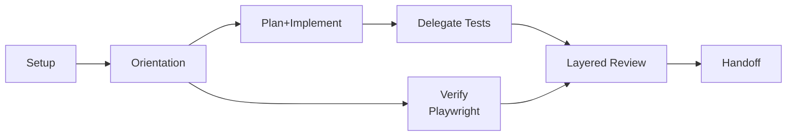

# AI-Assisted Development Workflow: "Complete the CRUD"

## Overview

This workflow shows how to take an intentionally incomplete FastAPI + MongoDB app (`example-api`) to production-ready CRUD using GitHub Copilot features, MCP servers, and disciplined review. It is designed as a teaching showcase: clear phases, concrete outcomes, and a clean handoff.

**Target App**: `example-api` (FastAPI + MongoDB)

**Goal**: Add missing CRUD functionality, validation, pagination, tests, UI verification, and handoff documentation.

---

## Prerequisites

### Required Tools
- GitHub Copilot Pro/Business/Enterprise
- VS Code with Copilot extension
- Docker Desktop
- Git + GitHub
- Ability to install MCP servers

### MCP Servers to Install
- **Context7** (`@upstash/context7-mcp`) — version-accurate docs
- **Smart-Tree** (`smart-tree`) — compressed project structure
- **Playwright MCP** (`@playwright/mcp`) — browser automation via accessibility tree

### Starting State (example-api)
- Existing endpoints: `GET /`, `GET /health`, `GET /items`, `POST /items`, `GET /items/{id}`, `DELETE /items/{id}`
- Missing: update endpoint, pagination, validation constraints, tests

---

## Phase 0 — Setup

### 0.1 Configure MCP Servers
Add to VS Code settings:
```json
{
  "mcpServers": {
    "context7": {"command": "npx", "args": ["-y", "@upstash/context7-mcp"]},
    "smart-tree": {"command": "npx", "args": ["-y", "smart-tree"]},
    "playwright": {"command": "npx", "args": ["-y", "@playwright/mcp"]}
  }
}
```

### 0.2 Create Project Conventions
Create `.github/copilot-instructions.md` with stack, commands, and coding standards. Keep it short but authoritative; this is what Copilot reads across sessions.

---

## Phase 1 — Orientation

### 1.1 Get Project Structure (Smart-Tree)
Prompt Copilot Chat to show `example-api/` with annotations.

### 1.2 Pull Live Docs (Context7)
Ask for:
- FastAPI PATCH patterns
- Motor `update_one` with `$set`
- Pydantic v2 `Field()` constraints

### 1.3 Gap Analysis
Ask Copilot to identify missing CRUD pieces, validation gaps, testing challenges, and security concerns.

**Outcome**: A clear list of what’s missing and why it matters.

---

## Phase 2 — Plan + Implement

### 2.1 Plan the Changes (Copilot Plan Mode)
Scope the work:
- Add `PATCH /items/{item_id}` with optional fields
- Add Pydantic `Field()` constraints
- Add pagination to `GET /items`

### 2.2 Validate Against Docs (Context7)
Confirm:
- `Optional` fields with constraints work in Pydantic v2
- `update_one(..., {"$set": fields})` is correct
- Use `model_dump(exclude_unset=True)` for PATCH

### 2.3 Revise and Execute
If the plan misses details (like empty-body handling), revise. Then implement.

**Key Implementation Notes**:
- Return 400 for invalid ObjectId
- Return 404 for missing item
- Return 400 for empty PATCH body

---

## Phase 3 — Delegate Tests (Coding Agent)

### 3.1 Create a Well-Scoped Issue
Define:
- Dependencies to add
- Required fixtures
- Explicit test cases per endpoint
- Acceptance criteria (all tests pass)

### 3.2 Delegate
Use `copilot /delegate #issue_number`.

**Why this works**: test writing is scoped, verifiable, and parallelizable.

---

## Phase 4 — E2E Verification (Playwright MCP)

### 4.1 Verify Swagger UI
Confirm all endpoints appear in `/docs`:
- `GET /`, `GET /health`, `GET /items`, `POST /items`, `GET /items/{item_id}`, `PATCH /items/{item_id}`, `DELETE /items/{item_id}`

### 4.2 Run a Minimal Smoke Test
Use Swagger UI to:
- Create an item
- List items
- PATCH an item
- Verify 422 for invalid payloads
- Verify pagination params

**Purpose**: confirm both API and documentation are correct.

---

## Phase 5 — Layered Review

### 5.1 Copilot Code Review
Request review on both the implementation PR and the test PR.

### 5.2 Targeted Security Review
Ask Copilot to check for:
- ObjectId validation
- Update payload abuse (`$set` fields)
- DoS risks (payload size)
- Error message leakage

### 5.3 Human Architectural Review
Confirm alignment with project goals:
- REST semantics
- extensibility (pagination, validation)
- long-term maintainability

---

## Phase 6 — Session Handoff

Create `docs/session-handoff-complete-crud.md` with:
- Summary of work done
- Open items (PRs, TODOs)
- Key decisions
- How to resume (commands)

**Why**: preserves context across sessions and prevents rework.

---

## End-to-End Diagram (Compressed)



---

## Key Insights

- **Plan mode** prevents wasted implementation by forcing design review.
- **MCP servers** ground the model in current docs and reduce token waste.
- **Delegation** is best for scoped, testable work.
- **Layered review** catches issues automated checks miss.
- **Handoffs** solve the “context evaporates” problem in AI-assisted work.
